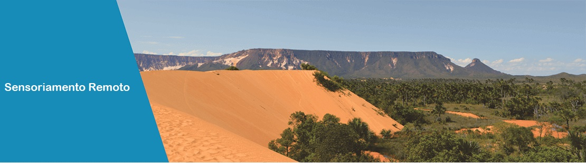
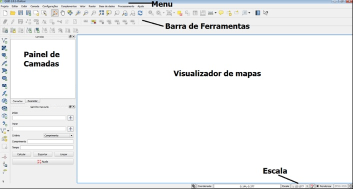
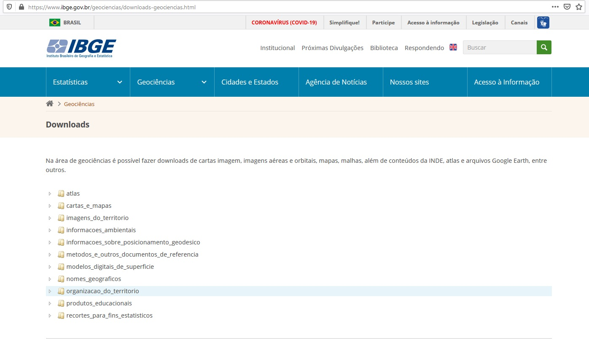
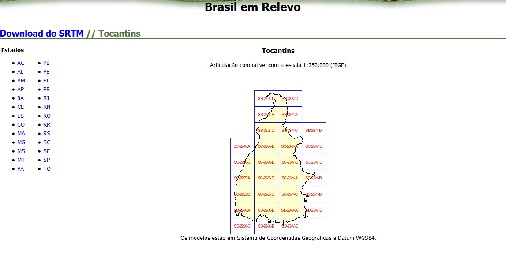
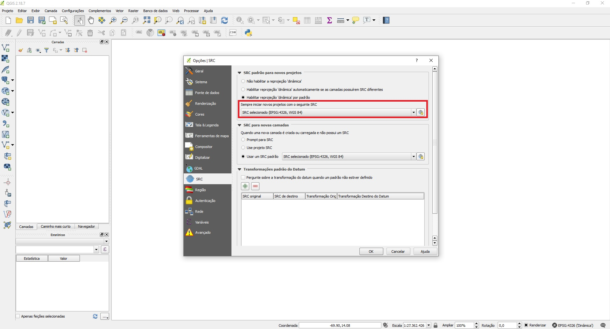

 
 

  

# Projeto Parcial 1 -  Tocantins
## Contexto Geral
### Tocantins

O Estado foi criado em **1988** e é dividido em **139** municípios. O Estado tem em  2020  uma  população  de  aproximadamente  1,5  milhões  de  pessoas em 2020.    Mais  de  um terço da população está concentrado nas cinco cidades maiores: Palmas, Araguaína, Gurupi,  Porto  Nacional  e  Paraíso  de  Tocantins.  Dados  com  respeito  à  densidade demográfica  mostram  que  a  população  se  concentra  ao  longo  dos  grandes  eixos rodoviários,  a  **BR  153**  e  as  rodovias  estaduais  050  e  040  que  ligam  a  cidade  de **Palmas a Brasília e Salvador**, respectivamente.

* Área: 277.621 km²
* Capital: Palmas
* Governador: Mauro Carlesse (out. de 2020)
* População: 1.383.445  (População no último censo 2010)
* Rendimento nominal mensal domiciliar per capita 1.056 R$ (ano de 2019)

### QGIS
O Quantum GIS **(QGIS)** é um Sistema de Informações Geográficas de Código Aberto. O projeto iniciou em maio de 2002 e foi reconhecido como um projeto no SourceForge em junho do mesmo ano. O QGIS atualmenteroda em muitas distribuições **Linux, Unix, Windows e OS X**. O QGIS é uma ferramenta **Sistema de Informação Geográfica-SIG** que é uma coleção de programas que permitem criar, visualizar, consultar e analisar dados geoespaciais. 

  

## Fonte de Dados

### Malha Municipal do Estado Tocantins de 2019 -IBGE
A Malha  Municipal  retrata  a  situação  vigente  da  Divisão  Político-Administrativa,  através  da  representação   vetorial   das   linhas   definidoras   das   divisas   estaduais   e   limites   municipais.  [Malha Municipal Tocantins -2019](https://geoftp.ibge.gov.br/organizacao_do_territorio/malhas_territoriais/malhas_municipais/municipio_2019/UFs/TO/TO.zip)

  

### Brasil em Relevo - EMBRAPA

A Embrapa Monitoramento por Satélite concluiu uma nova série de imagens do Brasil visto do espaço com detalhes do relevo e da topografia. As imagens são do satélite Landsat 7 de 2000/2001 

-Referência  MIRANDA, E. E. de; (Coord.).   Brasil em Relevo.   Campinas: Embrapa Monitoramento por Satélite, 2005.  Disponível em: <http://www.relevobr.cnpm.embrapa.br>.   Acesso em: 22 Out. 2020 

  

## QGIS - Configurações

### EPSG4674
Para poder trabalhar no Projeto Parcial será necessario configurar algunas opções no QGIS. Acessando  a  barra  de menu,  vá  em **Configurações/Opções|SRC**, será  aberta uma  janela  com  a  seguinte  configuração:  Sendo aba  SRC, verifique se o seu Quantum QGIS está configurado desta forma:

  

### Criar as pastas  CG_SIR e CG_WGS

